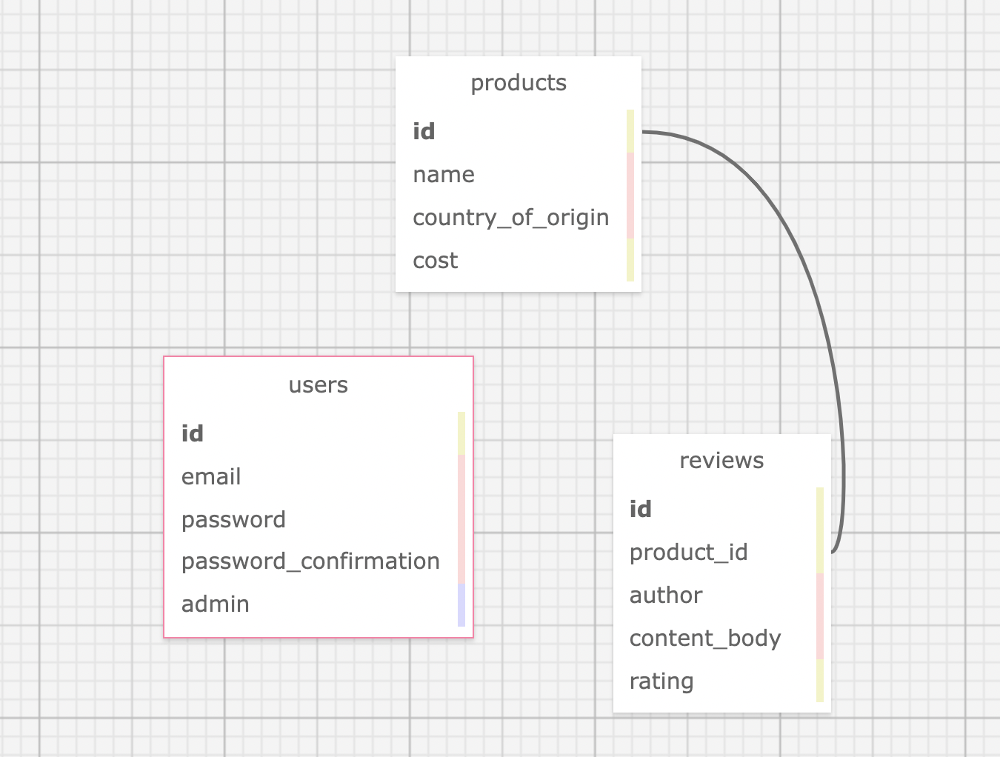

# _Mario's Food Products & Reviews_

#### Created By: Morgan Waites

#### Ruby on Rails app for a fictional online food products store owned by a fictitious Mario. User accounts, relational database, CRUD functionality, and other fun stuff. This project was built for Epicodus code bootcamp independent project.

## Technologies Used

* _Ruby_
* _Gems_
* _Bundler_
* _RSpec_
* _shoulda matchers_
* _IRB_
* _Pry_
* _Capybara_
* _Postgres_
* _SQL_
* _SQL Designer_
* _Rails_
* _ActiveRecord_
* _Bootstrap scss_
* _faker_
* _Devise_
* _SimpleCov_

## Description

This project was created for Epicodus bootcamp to show proficiency in Rails with Active Record as well as generating a user with user functionality/authentication using Devise. The application is for Mario's company to organize products and their reviews. The admin user add/remove/edit products and reviews belonging to them, while non-user admin can only view products, reviews, and add reviews. Shows one-to-many relationship.

## Database Schema

## System Requirements

* Ruby v2.6.5 recommended
* Postgres 12.9  
_(Note: Ruby gem dependencies will be installed automatically by Bundler.)_

## Setup/Installation Requirements

* Clone the GitHub repository: https://github.com/mellowmorgan/mario-foods-site.git
* From the main project directory, enter `bundle install` in the terminal to populate gems.
* To create a database, type in your terminal:  
      `rake db:setup`
* Enter `rspec` into the terminal to confirm passing of all tests.
* Run `rails s` to start the Rails server.
* Open browswer and enter the url http://localhost:3000/ unless otherwise prompted in the terminal.
* Log in with admin@test.com password testing for admin privileges; log in with test@test.com password testing for non-admin user privileges.

## Known Bugs

* _Mailer with Devise is not set up._
* _This app is in development and not hosted anywhere._
* _Will try to launch on Heroku soon._

## License

[MIT](https://opensource.org/licenses/MIT) Copyright (c) 2022 Morgan Waites