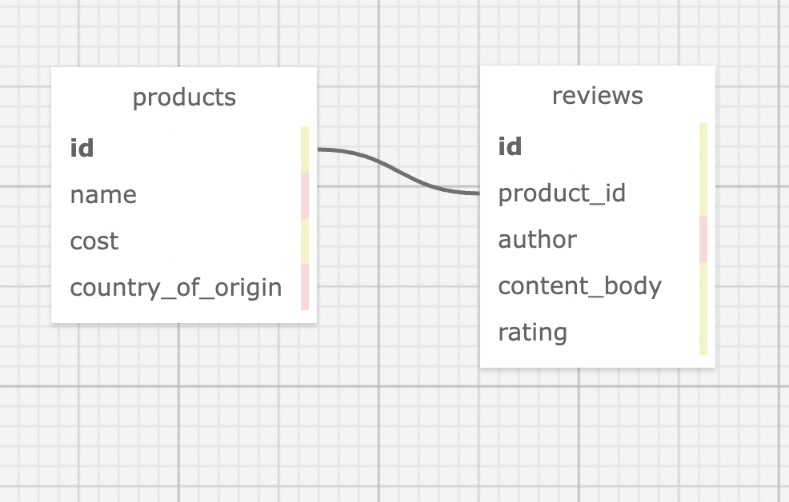

# _Mario's Food Products & Reviews_

#### _Ruby on Rails with Active Record Practice project for Epicodus Bootcamp_

#### Created By: Morgan Waites

## Technologies Used

* _Ruby_
* _Gems_
* _Bundler_
* _RSpec_
* _shoulda matchers_
* _IRB_
* _Pry_
* _Capybara_
* _Postgres_
* _SQL_
* _SQL Designer_
* _Rails_
* _ActiveRecord_
* _Bootstrap scss_
* _faker_

## Description

This project was created for Epicodus bootcamp to show proficiency in Rails with Active Record. The application is for Mario's company to organize products and their reviews. The user can add/remove/edit products and reviews belonging to them, shows one-to-many relationship.

## Database Schema

## System Requirements

* Ruby v2.6.5 recommended
* Postgres 12.9  
_(Note: Ruby gem dependencies will be installed automatically by Bundler.)_

## Setup/Installation Requirements

* Clone the GitHub repository: https://github.com/mellowmorgan/mario-foods-site.git
* From the main project directory, enter `bundle install` in the terminal to populate gems.
* To create a database, type in your terminal:  
      `rake db:setup`
* Enter `rspec` into the terminal to confirm passing of all tests.
* Run `rails s` to start the Rails server.
* Open browswer and enter the url http://localhost:3000/ unless otherwise prompted in the terminal.

## Known Bugs

* _None at this time._

## License

[MIT](https://opensource.org/licenses/MIT)_
Copyright (c) _2022_ _Morgan Waites_